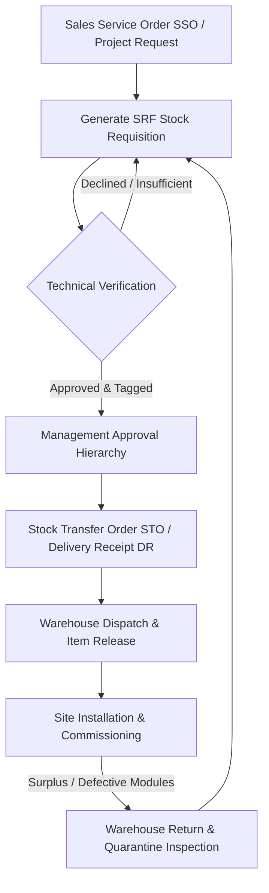

# 🏢 Globaltronics Warehouse Management & Control System (GBTX WHMS)

[](https://laravel.com)
[](https://php.net)
[](https://tailwindcss.com)
[](https://mysql.com)

**GBTX WHMS** is an enterprise-grade Warehouse Control & Inventory Management System specifically engineered for **Globaltronics** to supervise LED display systems, digital signage units, spare modules, structural hardware, and cross-departmental installation project logistics.

---

## 📌 Table of Contents

- [Core Features](#-core-features)
- [Operational & Project Workflows](#-operational--project-workflows)
- [Role-Based Access Control (RBAC)](#-role-based-access-control-rbac)
- [Database & Data Architecture](#-database--data-architecture)
- [Getting Started & Installation](#-getting-started--installation)
- [Default System Credentials](#-default-system-credentials)
- [Artisan CLI Commands](#-artisan-cli-commands)
- [Project Directory Structure](#-project-directory-structure)

---

## 🚀 Core Features

### 1. 📦 Comprehensive Inventory Management
- **LED & Display Cataloging**: Track LED cabinets, modules, controllers, power supplies, and EOL (End of Life) Philips commercial display units.
- **Granular Spec Tracking**: Manages manufacturer, model number, screen diagonal size, square meter (`sqm`) surface area, tag identifiers, and purchase order (`PO`) references.
- **Multi-Level Stock Metrics**: Real-time quantity balances, physical quantities, forecasted allocations, and ACU (Air Conditioning / Auxiliary) units.
- **Location & Quarantine Segregation**: Categorize inventory into active storage bays, defective quarantine bins, maintenance staging, and reserved stock.

### 2. 📋 Stock Requisition Form (SRF) Lifecycle
- **Sales & Project Linkage**: Ties stock requisitions to Sales Service Orders (SSO), clients, project milestones, and target required dates.
- **Strict Verification Protocol**: Hardware requisition verification with physical serial checks before stock leaves the warehouse.
- **Four-Tier Signatory Chain**:
  1. **Prepared By**: Requisitioning engineer or sales handler.
  2. **Noted By**: Floor supervisor or operational lead.
  3. **Pre-Approved By**: Technical specialist / hardware evaluator.
  4. **Approved By**: Executive authority (e.g., General Manager / VP).
- **Printable PDF Forms**: Real-time SRF export formatted for print clearance and physical sign-offs.

### 3. 🏭 Floor Operations & Stock Movements
- **Dispatch Order Execution**: Decrements stock, updates carrier logs, and confirms physical release.
- **Cycle Count Adjustments**: In-place reconciliation to true up physical shelf counts against system balances.
- **Return Processing**: Re-ingest uninstalled units, client returns, or serviced modules back into active or quarantine stock.

### 4. 🔔 Audit Trail & Notifications
- Persistent transaction logs capturing every item dispatch, verification, user creation, and status change.
- Unread badge counters, user-targeted notifications, and mark-as-read capabilities.

---

## 🔄 Operational & Project Workflows



1. **SRF Submission**: Requester submits item requirements tagged against an SSO number and client site.
2. **Technical Verification**: Technical specialist tests and confirms model compatibility and reserved item counts.
3. **Approval Sign-off**: Departmental and management signatories approve release.
4. **Dispatch Clearance**: Warehouse staff picks, stages, and issues the Delivery Receipt (DR) / Stock Transfer Order (STO).
5. **Returns & Cycle Counts**: Any leftover parts or replaced modules return to the warehouse with updated inspection notes.

---

## 👥 Role-Based Access Control (RBAC)

The system enforces strict permission boundaries based on user roles:

| Role | Slug | Key Responsibilities |
| :--- | :--- | :--- |
| **IT Administrator** | `it-admin` | Full system control, role permissions, user credentials, audit policies, system settings. |
| **Warehouse Admin** | `warehouse-admin` | Warehouse floor operations, bay storage, stock dispatches, returns, cycle counts. |
| **Warehouse Staff** | `warehouse-staff` | Pallet handling, item picking, status updates, barcode/tag registration. |
| **Inventory Supervisor** | `inventory-supervisor` | Stock reconciliation, periodic audits, variance analysis, discrepancy approvals. |
| **Dispatch Officer** | `dispatch-officer` | Outbound shipping manifests, logistics carrier clearances, delivery receipts. |
| **Sales Executive** | `sales-executive` | Customer project initiation, SSO submission, draft stock requisitions. |
| **Technical Specialist** | `technical` | SRF verification, hardware testing, display diagnostics, return inspection. |

---

## 🗄️ Database & Data Architecture

The application supports both **SQLite** (for zero-configuration local deployment) and **MySQL / MariaDB** (for high-concurrency production deployments).

### Primary Tables Overview

```
├── users                       (Authentication & account details)
├── roles                       (Access roles & permission metadata)
├── role_user                   (Many-to-many pivot mapping users to roles)
├── inventory_items             (Core inventory catalog, quantities, specs, tags)
├── srf_requisitions            (Project stock requisitions, signatories, approval status)
├── transaction_notifications   (Audit alerts, notifications, and reference linkages)
├── password_reset_tokens       (Security tokens for password recovery)
├── sessions                    (Active session store)
├── jobs & job_batches          (Asynchronous queue worker infrastructure)
└── cache & cache_locks         (Performance cache and atomic race-condition locks)
```

### Exporting Standalone SQL
You can export the entire database (schema DDL + active data) at any time:
```bash
php artisan db:export-sql
```
This produces:
- `database/gbtx_appwhms_mysql.sql` — MySQL 5.7+ / 8.0+ / MariaDB ready for phpMyAdmin or cloud instances.
- `database/gbtx_appwhms_sqlite.sql` — Complete SQLite 3 dump.

---

## 💻 Getting Started & Installation

### Prerequisites
- **PHP** >= 8.3 (with `pdo`, `mbstring`, `openssl`, `tokenizer`, `xml`, `ctype`, `json`, `sqlite3` or `mysql` extensions)
- **Composer** >= 2.x
- **Node.js** >= 18.x & **NPM**

### 1. Clone the Repository
```bash
git clone https://github.com/globaltronics/gbtx-appwhms.git
cd GBTX_APPWHMS
```

### 2. Install Dependencies
```bash
composer install
npm install
```

### 3. Environment Setup
```bash
cp .env.example .env
php artisan key:generate
```

Configure your database connection in `.env`:
```env
# Default SQLite configuration
DB_CONNECTION=sqlite

# Or switch to MySQL
# DB_CONNECTION=mysql
# DB_HOST=127.0.0.1
# DB_PORT=3306
# DB_DATABASE=gbtx_appwhms
# DB_USERNAME=root
# DB_PASSWORD=your_password
```

### 4. Run Migrations & Seed Data
```bash
# Prepare the database and seed initial roles, users, and 180+ inventory items
php artisan migrate --seed
```

### 5. Launch Development Server
```bash
# Terminal 1: Backend
php artisan serve

# Terminal 2: Vite Frontend Assets
npm run dev
```
Navigate to: **`http://localhost:8000`**

---

## 🔑 Default System Credentials

| Role | Name | Email | Password |
| :--- | :--- | :--- | :--- |
| **IT Admin** | Mark Estoesta | `mark.estoesta@globaltronics.net` | `GlobaltronicsAdmin@2026` |
| **Warehouse Admin** | Joshua Labios | `joshua.labios@globaltronics.net` | `GlobaltronicsAdmin@2026` |
| **Warehouse Staff** | Warehouse Staff User | `staff@globaltronics.net` | `GlobaltronicsUser@2026` |
| **Technical Specialist** | Ariel Moro | `ariel.moro@globaltronics.net` | `GlobaltronicsTech@2026` |
| **Sales Executive** | Sales Account Executive | `sales@globaltronics.net` | `GlobaltronicsSales@2026` |

*(Note: Change passwords immediately in production via Admin Settings > Credentials).*

---

## 🛠️ Artisan CLI Commands

| Command | Description |
| :--- | :--- |
| `php artisan db:export-sql` | Exports current schema and real-time dataset into standalone `.sql` files. |
| `php artisan migrate:status` | Inspects migration status and database schema versioning. |
| `php artisan db:show` | Displays current database statistics, table lists, and row counts. |
| `php artisan route:list` | Lists all administrative, inventory, and requisition HTTP routes. |

---

## 📂 Project Directory Structure

```
GBTX_APPWHMS/
├── app/
│   ├── Console/Commands/      # Custom artisan commands (e.g. ExportDatabaseSql)
│   ├── Http/Controllers/Admin/# Dashboard, Inventory, Roles, Users, Credentials
│   └── Models/                # Eloquent models (InventoryItem, SrfRequisition, Role, User)
├── database/
│   ├── factories/             # Model factories for testing
│   ├── migrations/            # Table migrations with schema evolution
│   ├── seeders/               # DatabaseSeeder, InventoryItemSeeder, RoleSeeder
│   ├── gbtx_appwhms_mysql.sql # Exported production MySQL database dump
│   └── database.sqlite        # Active SQLite local database
├── resources/
│   ├── views/                 # Blade templates, Dashboard, SRF PDF layouts, Welcome
│   └── css/ & js/             # Tailwind stylesheets and front-end scripts
├── routes/
│   ├── web.php                # Authentication, Admin, Inventory & Workflow routes
│   └── console.php            # Artisan console routes
└── tests/                     # Unit and Feature automated tests
```

---

## 🛡️ License & Copyright

Proprietary Software — Developed exclusively for **Globaltronics** (GBTX). All rights reserved.
